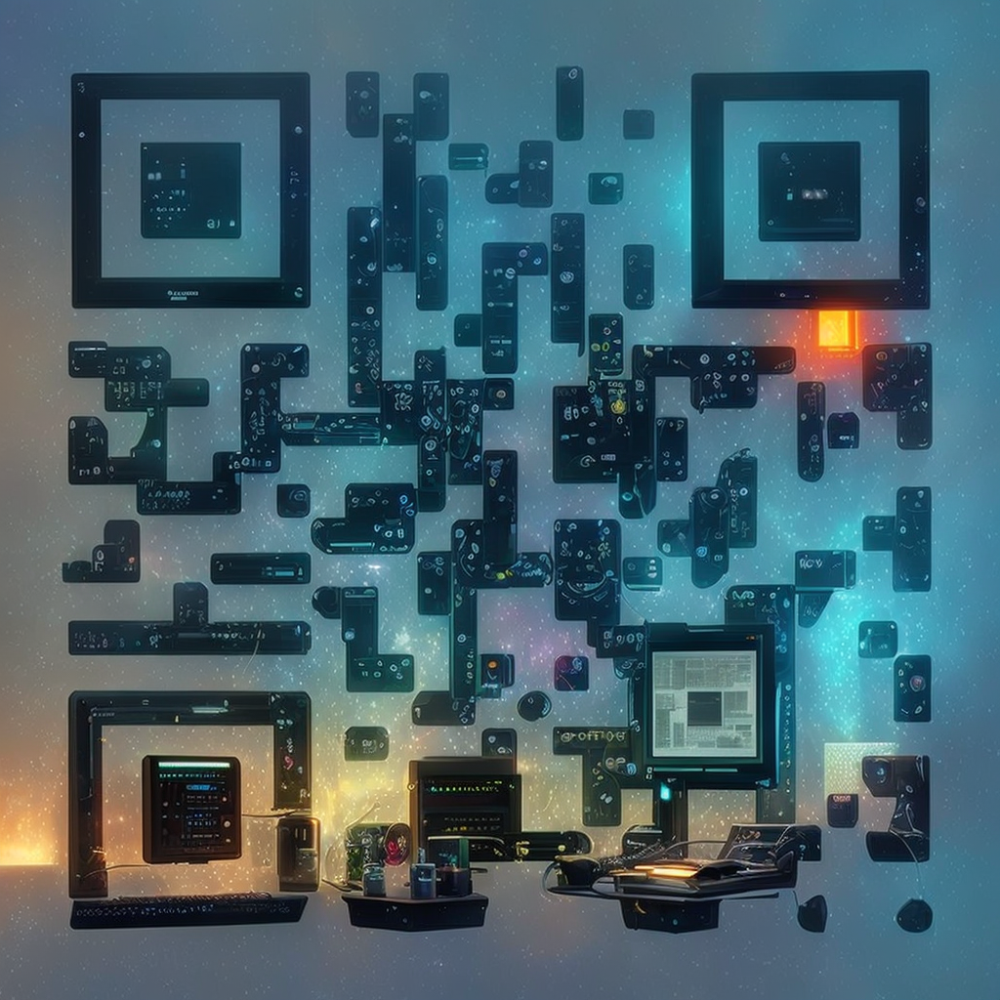

# Introduction to AI Tools and Resources

AI models use machine learning to generate images, text, voices, and more.  
For AI-generated images, a **model** (like Stable Diffusion) serves as the core engine, while a **UI (User Interface)** provides an easier way to interact with it.  

- **Front-Ends (UIs)**: Interfaces that help users interact with models (e.g., AUTOMATIC1111, ComfyUI).  
- **Models**: AI systems trained to generate content (e.g., SDXL, FLUX, Lumina).  
- **Resources & Prompts**: Guides, settings, and additional tools to refine AI outputs.  

## Getting Started with a Front-End UI (User Interface)

🔹 **Note**: Running most AI models locally **requires a GPU with at least 6GB of VRAM** (e.g., NVIDIA RTX 2060 or better). Lower-end hardware may experience long processing times.

1. **Simplified Installation via Pinokio**  
   A broader, multi-platform option for installing various AI applications, including Stable Diffusion front-ends, is available through Pinokio:  
   [Pinokio AI Platform](https://pinokio.computer/)

2. **Manual Installation**  
   Step-by-step instructions for setting up AUTOMATIC1111 and ComfyUI, two of the most popular Stable Diffusion front-ends, on Windows can be found here:  
   [Windows Installation Guide](https://stable-diffusion-art.com/install-windows/)  
   [Apple Silicon M1/M2 Macs Installation Guide](https://stable-diffusion-art.com/install-mac/)  
   [Google Colab](https://stable-diffusion-art.com/automatic1111-colab/)  
   [Linux Install](https://github.com/AUTOMATIC1111/stable-diffusion-webui?tab=readme-ov-file#automatic-installation-on-linux)

### Essential Stable Diffusion Resources

> These resources help you get better results and understand what’s happening under the hood.

- **Prompt Engineering**: Understanding how to craft effective prompts  
  [Prompt Guide](https://stable-diffusion-art.com/prompt-guide/)  

- **ControlNet**: Enhancing AI-generated images with additional control  
  [ControlNet Overview](https://stable-diffusion-art.com/controlnet/)

- **Model Selection**: Finding the right AI model for specific use cases  
  [SDXL Models](https://stable-diffusion-art.com/sdxl-model/)  
  [Flux Model](https://stable-diffusion-art.com/flux/)  
  [SDXL vs Flux1.dev models comparison](https://stable-diffusion-art.com/sdxl-vs-flux/)

## **Model Downloads**  

[🔗](https://huggingface.co/runwayml/stable-diffusion-v1-5/resolve/main/v1-5-pruned-emaonly.safetensors) **[Stable Diffusion v1.5](https://huggingface.co/stable-diffusion-v1-5/stable-diffusion-v1-5)**  
[🔗](https://huggingface.co/stabilityai/stable-diffusion-2-1/resolve/main/768-v-ema.ckpt) **[Stable Diffusion 2.1](https://huggingface.co/stabilityai/stable-diffusion-2-1)**  
[🔗](https://huggingface.co/stabilityai/stable-diffusion-xl-base-1.0/resolve/main/sd_xl_base_1.0.safetensors) **[Stable Diffusion XL (SDXL) Base 1.0](https://huggingface.co/stabilityai/stable-diffusion-xl-base-1.0/)**  
[🔗](https://huggingface.co/stabilityai/stable-diffusion-xl-refiner-1.0/resolve/main/sd_xl_refiner_1.0.safetensors) **[Stable Diffusion XL (SDXL) Refiner 1.0](https://huggingface.co/stabilityai/stable-diffusion-xl-refiner-1.0/)**  
[🔗](https://huggingface.co/black-forest-labs/FLUX.1-dev/blob/main/flux1-dev.safetensors) **[FLUX Model](https://huggingface.co/black-forest-labs/FLUX.1-dev)**  
[🔗](https://huggingface.co/lllyasviel/flux1_dev/resolve/main/flux1-dev-fp8.safetensors) **[FLUX 1 Dev FP8](https://huggingface.co/lllyasviel/flux1_dev/)**  
[🔗](https://huggingface.co/Alpha-VLLM/Lumina-Image-2.0/resolve/main/lumina-image-v2-fp16.safetensors) **[Lumina Image 2.0](https://huggingface.co/Alpha-VLLM/Lumina-Image-2.0/)**  
[🔗](https://huggingface.co/SG161222/Realistic_Vision_V5.1_noVAE/resolve/main/Realistic_Vision_V5.1_fp16-no-ema.safetensors) **[Realistic Vision V5.1 (No VAE)](https://huggingface.co/SG161222/Realistic_Vision_V5.1_noVAE)**  
[🔗](https://civitai.com/api/download/models/5636?type=Pruned%20Model&format=SafeTensor) **[AbyssOrangeMix 3 (Pruned)](https://civitai.com/models/5636/abyssorangemix3)**  
[🔗](https://huggingface.co/XpucT/Deliberate/resolve/main/Deliberate_v2.safetensors) **[Deliberate v2](https://huggingface.co/XpucT/Deliberate/)**  
[🔗](https://huggingface.co/acheong08/f222/resolve/main/f222.ckpt) **[f222 Model](https://huggingface.co/acheong08/f222/)**  
🔗 **[Juggernaut XL](https://civitai.com/models/133005/juggernaut-xl)**  
🔗 **[DreamShaper XL](https://civitai.com/models/112902/dreamshaper-xl)**  
🔗 **[RealVisXL V5.0](https://civitai.com/models/139562/realvisxl-v40)**  
🔗 **[CyberRealistic](https://civitai.com/models/15003/cyberrealistic)**  

### **How to Use Models?**

After downloading a Stable Diffusion model, place the `.safetensors` or `.ckpt` file in the correct directory of your chosen UI.

> Restart the UI after adding new models so they appear in the model dropdown.

- **AUTOMATIC1111**  
  - Place models in:  
    📂 `stable-diffusion-webui/models/Stable-diffusion/`  
  - Select from the dropdown in the UI.  

- **ComfyUI**  
  - Place models in:  
    📂 `ComfyUI/models/checkpoints/`  
  - Load the model in a **Checkpoint Loader** node.  

> TO SHARE MODELS BETWEEN COMFYUI AND ANOTHER UI:  
> In the ComfyUI directory you will find a file: extra_model_paths.yaml.example  
> Rename this file to: extra_model_paths.yaml and edit it with your favorite text editor.

## **LoRA Models (Fine-Tuning for More Control)**  
LoRA (Low-Rank Adaptation) models allow users to **fine-tune Stable Diffusion** by adding specialized styles, characters, or concepts without modifying the full model. They are smaller than full AI models, making them faster and more efficient.  

  [What are LoRA models and how to use them in AUTOMATIC1111](https://stable-diffusion-art.com/lora/)

- **Why Use LoRAs?**  
  - Fine-tune a model to generate **specific styles or subjects**.  
  - Require **less VRAM** than full custom models.  
  - Easily switch between LoRAs for different artistic effects.  

- **Where to Find LoRAs?**  
  - 🔗 **[CivitAI](https://civitai.com/)** – Largest repository of user-generated LoRA models.  
  - 🔗 **[Hugging Face](https://huggingface.co/)** – Hosts various pre-trained LoRAs.  

- **How to Use LoRAs?**  
  - In **AUTOMATIC1111**, place the `.safetensors` file into the **`models/Lora/`** folder.  
  - Activate by adding `lora:model_name` in your prompt.  
  - Adjust LoRA strength with `<lora:model_name:0.7>` (0.1-1.0 range).  

## **ControlNet (and Other Extensions)**  
Extensions add powerful functionality to your AI workflow, enabling more control, structure, and creative freedom. Once you’re comfortable generating images from text, these tools will let you take control of composition, style, and fine detail.  
ControlNet is the most widely used extension, allowing models to follow guidance from sketches, depth maps, poses, and even image prompts.  

> **📋 Right-click the clipboard icon to copy the direct install link, then paste it into the Extensions > Install from URL box.**

[📋](https://github.com/Mikubill/sd-webui-controlnet.git)[ControlNet (core extension)](https://github.com/Mikubill/sd-webui-controlnet) — Add structure with input guides like canny edges, depth maps, or poses.  
[📋](https://github.com/CMU-Perceptual-Computing-Lab/openpose.git)[OpenPose Editor](https://github.com/CMU-Perceptual-Computing-Lab/openpose) — Create or edit poses for use in ControlNet.  
[📋](https://github.com/hako-mikan/sd-webui-regional-prompter.git)[Regional Prompter](https://github.com/hako-mikan/sd-webui-regional-prompter) — Use different prompts in different areas of an image.  
[📋](https://github.com/antfu/sd-webui-qrcode-toolkit.git)[QR Code Toolkit](https://github.com/antfu/sd-webui-qrcode-toolkit) — Generate and style scannable QR codes using Stable Diffusion.    
[📋](https://github.com/LEv145/--sd-webui-ar-plus.git)[Aspect Ratio Selector Plus](https://github.com/LEv145/--sd-webui-ar-plus) — Advanced aspect ratio management for AUTOMATIC1111.  
[📋](https://github.com/zanllp/sd-webui-infinite-image-browsing.git)[Infinite Image Browser](https://github.com/zanllp/sd-webui-infinite-image-browsing) — Browse your generations in a clean, searchable interface.  
[📋](https://github.com/pharmapsychotic/clip-interrogator-ext.git)[CLIP Interrogator](https://github.com/pharmapsychotic/clip-interrogator-ext) — Analyze images to reverse-engineer prompt ideas. (Large download on first use)  
[📋](https://github.com/deforum-art/sd-webui-deforum.git)[Deforum](https://github.com/deforum-art/sd-webui-deforum) — Animation and video generation with Stable Diffusion.  
[📋](https://github.com/Coyote-A/ultimate-upscale-for-automatic1111.git)[Ultimate SD Upscale](https://github.com/Coyote-A/ultimate-upscale-for-automatic1111) — High-quality upscaling for AI-generated images.  
[📋](https://github.com/Bing-su/adetailer.git)[After Detailer](https://github.com/Bing-su/adetailer) — Automatic post-processing to refine faces and small details. (Download on first ui launch after install)  

### **Managing Extensions**  
- To remove an extension, close the UI and delete its folder from:  
  📂 `stable-diffusion-webui/extensions/`  
- Then restart the UI and check the Extensions tab to confirm removal.  

## **ControlNet Adapters (Optional Advanced Control)**  
ControlNet Adapters are specialized models that help guide the AI using different input types like canny edges, depth maps, sketches, or color references. They allow for **precise structural or style control** over your generated images.  

- **Why Use ControlNet Adapters?**  
  - Add structure, pose, or composition control using external inputs.  
  - Generate consistent layouts or design elements from reference guides (like sketches or depth maps).  
  - Useful for tasks like **custom QR code generation**, architectural outlines, and stylized compositions.  

- **Where to Download [T2I-Adapters](https://huggingface.co/TencentARC/T2I-Adapter)?**  
  - [📥](https://huggingface.co/TencentARC/T2I-Adapter/resolve/main/models/t2iadapter_canny_sd14v1.pth) **T2I Adapter Canny (SD 1.4 v1)**  
  - [📥](https://huggingface.co/TencentARC/T2I-Adapter/resolve/main/models/t2iadapter_canny_sd15v2.pth) **T2I Adapter Canny (SD 1.5 v2)**  
  - [📥](https://huggingface.co/TencentARC/T2I-Adapter/resolve/main/models/t2iadapter_color_sd14v1.pth) **T2I Adapter Color (SD 1.4 v1)**  
  - [📥](https://huggingface.co/TencentARC/T2I-Adapter/resolve/main/models/t2iadapter_depth_sd14v1.pth) **T2I Adapter Depth (SD 1.4 v1)**  
  - [📥](https://huggingface.co/TencentARC/T2I-Adapter/resolve/main/models/t2iadapter_depth_sd15v2.pth) **T2I Adapter Depth (SD 1.5 v2)**  
  - [📥](https://huggingface.co/TencentARC/T2I-Adapter/resolve/main/models/t2iadapter_keypose_sd14v1.pth) **T2I Adapter Keypose (SD 1.4 v1)**  
  - [📥](https://huggingface.co/TencentARC/T2I-Adapter/resolve/main/models/t2iadapter_openpose_sd14v1.pth) **T2I Adapter OpenPose (SD 1.4 v1)**  
  - [📥](https://huggingface.co/TencentARC/T2I-Adapter/resolve/main/models/t2iadapter_seg_sd14v1.pth) **T2I Adapter Segmentation (SD 1.4 v1)**  
  - [📥](https://huggingface.co/TencentARC/T2I-Adapter/resolve/main/models/t2iadapter_sketch_sd14v1.pth) **T2I Adapter Sketch (SD 1.4 v1)**  
  - [📥](https://huggingface.co/TencentARC/T2I-Adapter/resolve/main/models/t2iadapter_sketch_sd15v2.pth) **T2I Adapter Sketch (SD 1.5 v2)**  
  - [📥](https://huggingface.co/TencentARC/T2I-Adapter/resolve/main/models/t2iadapter_style_sd14v1.pth) **T2I Adapter Style (SD 1.4 v1)**  
  - [📥](https://huggingface.co/TencentARC/T2I-Adapter/resolve/main/models/t2iadapter_zoedepth_sd15v1.pth) **T2I Adapter ZoeDepth (SD 1.5 v1)**  

- **How to Use ControlNet Adapters?**  
  - Place adapter `.pth` files in:  
    📂 `stable-diffusion-webui\extensions\sd-webui-controlnet\models`  
  - In **AUTOMATIC1111**, enable ControlNet and select the adapter from the dropdown.  
  - Upload the corresponding input (sketch, canny, depth map) in the ControlNet panel.  
  - Generate with your text prompt + adapter input.  

## **IP-Adapters (Image Prompt Adapters)**  
IP-Adapters allow you to guide AI generations using **images** in addition to text prompts. They blend features, style, or structure from a reference image with your instructions.
> IP-Adapters appear as an option in ControlNet once the `.pth` files are placed in the appropriate folder.
- **Why Use IP-Adapters?**  
  - Generate images that match the **style, color palette, or composition** of an input image.  
  - Combine image reference and text prompts for more precise control.  
  - Great for replicating designs, poses, or custom palettes (such as custom QR codes).  

- **Where to Download IP-Adapters?**  
  - [🔗](https://huggingface.co/lllyasviel/sd_control_collection/resolve/main/ip-adapter_sd15.pth) **IP-Adapter SD15 (standard)**  
  - [🔗](https://huggingface.co/lllyasviel/sd_control_collection/resolve/main/ip-adapter_sd15_plus.pth) **IP-Adapter SD15 Plus (stronger feature retention)**  
  - [🔗](https://huggingface.co/lllyasviel/sd_control_collection/resolve/main/ip-adapter-face_sd15.pth) **IP-Adapter Face SD15 (portrait-focused)**  
  - [🔗](https://huggingface.co/lllyasviel/sd_control_collection/resolve/main/ip-adapter-face_sd15_plus.pth) **IP-Adapter Face Plus SD15 (strong face retention)**  

- **How to Use IP-Adapters?**  
  - Place the `.pth` files in:  
    📂 `stable-diffusion-webui\extensions\sd-webui-controlnet\models`  
  - In **AUTOMATIC1111**, select an **IP-Adapter** option from the ControlNet dropdown.  
  - Load your reference image in ControlNet.  
  - Use text prompts to fine-tune the output.  
  - The **Plus** version is ideal if you want the generation to closely follow the reference image.  

  > - For **face-specific adapters**, results are strongest with clear reference photos.  

## Specialized Applications

### QR Code Generation
QR codes can be customized in intricate ways beyond simple black-and-white patterns. Here’s an example of a video showcasing advanced QR code designs:  
[📺 Watch the video](https://www.youtube.com/watch?v=nFfHEmNu0Zk)

For a deeper understanding of how QR codes work on a technical level, this video explains the mechanics behind them:  
[📺 Technical QR Code Breakdown](https://www.youtube.com/watch?v=w5ebcowAJD8)

### **QR Code Generation with ControlNet**  
ControlNet can be used to generate artistic or stylized QR codes while preserving scanability. This allows you to create unique designs, custom palettes, and branded codes.

### **Recommended QR Code ControlNet Models**  

- [🔗](https://huggingface.co/DionTimmer/controlnet_qrcode) **QR Code Conditioned ControlNet Models (SD 1.5 and SD 2.1)** — Official general-purpose QR code models for structured, scannable codes.  

- [🔗](https://civitai.com/models/90940?modelVersionId=96917) **Controlnet QR Pattern v1 (SD 1.5)** — First version for subtle artistic pattern integration.  

- [🔗](https://civitai.com/models/90940?modelVersionId=111973) **Controlnet QR Pattern v2 (SD 1.5)** — More creative and bold pattern stylization.  

- [🔗](https://civitai.com/models/111006?modelVersionId=119698) **QR Code Monster v1** — Stylized, artistic QR codes that still scan well (first version).  

- [🔗](https://civitai.com/models/111006?modelVersionId=122143) **QR Code Monster v2** — Improved version with better balance between style and scanning reliability.  

### **Where to Place These Models:**  
Place `.safetensors` files in:  
📂 `stable-diffusion-webui\models\ControlNet`

### **Tips for Successful QR Code Generation:**  
- Start with **high-contrast black and white QR codes** as your input image.  
- Use **low to medium ControlNet weights** (0.7 to 1.0).  
- Set denoise strength between **0.4 and 0.6** for the best balance between style and scanability.  
- Keep outputs at **512x512 resolution** for reliable results.  
- Always test the generated QR codes with a scanner before using them in print or production.  

> **Example Prompt:**  
> `an intricate, stylized QR code design, pastel color palette, soft shadows, clean edges, digital art`

## AI Voice and Face Cloning
For those interested in AI-driven media manipulation, this video covers voice and face cloning for videos:  
[📺 AI Voice and Face Cloning](https://www.youtube.com/watch?v=-brbxJ43F1c)

## Further Learning
For in-depth tutorials and resources beyond video content:
- **Comprehensive AI Tutorials**:
  - [AI Tutorials](https://stable-diffusion-art.com/tutorials/)
- **Downloadable AI Models & Resources**:  
  - [Hugging Face](https://huggingface.co/)  
  - [CivitAI](https://civitai.com/)
- **About Computer Neural Networks**:
  - [📺 Future Computers Will Be Radically Different (Analog Computing)](https://www.youtube.com/watch?v=GVsUOuSjvcg)

## **Community & Support**  
Joining AI-focused communities is a great way to learn, troubleshoot issues, and stay updated with the latest developments.  

- **Reddit** – Discussions on AI models, updates, and troubleshooting.  
  🔗 [r/StableDiffusion](https://www.reddit.com/r/StableDiffusion/)  
  🔗 [r/ArtificialInteligence](https://www.reddit.com/r/ArtificialInteligence/)  

- **Discord** – Live discussions, support, and AI-generated art sharing.  
  🔗 [Stable Diffusion Discord](https://discord.gg/stablediffusion)  

- **Hugging Face Forums** – Official discussion hub for AI models.  
  🔗 [Hugging Face Community](https://discuss.huggingface.co/)  
